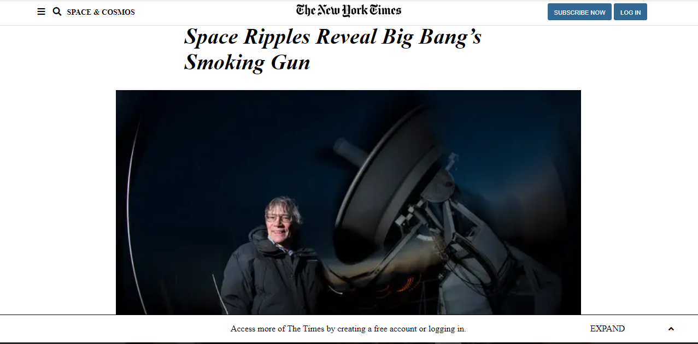

# Position and Floating

Project #3 Cloning a NY Times article

This project is about using Positioning and Floating
cloning an article of the New York Times.

## Built With

- HTML,
- CSS,

## Live Demo

[Live Demo Link](https://cvilla714.github.io/floating/)

👤 **Cosmel Villalobos**

- Github: [@cvilla714](https://github.com/cvilla714)
- Twitter: [@kckeyti](https://twitter.com/kckeyti)
- LinkedIn: [Cosmel Villalobos](https://www.linkedin.com/in/cosvilla/)

👤 **abmasadullah**

- Github: [@abmasadullah](https://github.com/abmasadullah)
- Twitter: [@abmasadullah](https://twitter.com/abmasadullah)
- Linkedin: [abmasadullah](https://www.linkedin.com/in/abmasadullah/)
